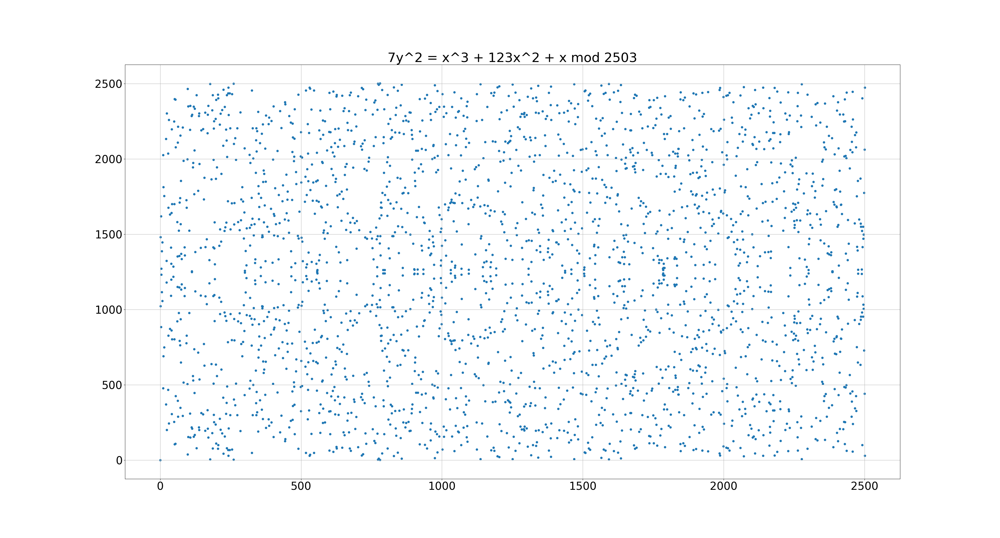

# Elliptic Curve Fun
This is a Python library enabling you to play around with elliptic curves. 

These scripts are not optimized for speed or security!
They are for **educational purposes** only!

Directory `basics` gives an intuition about elliptic curves and their applications.

The `curve25519` directory shows how Curve25519 uses the montgommery
ladder with point compression using only XZ coordinates.

**You can also plot with this library:**

Weierstrass, Edwards and Montgomery Curves:

Elliptic Curve with highlighted subgroups:

